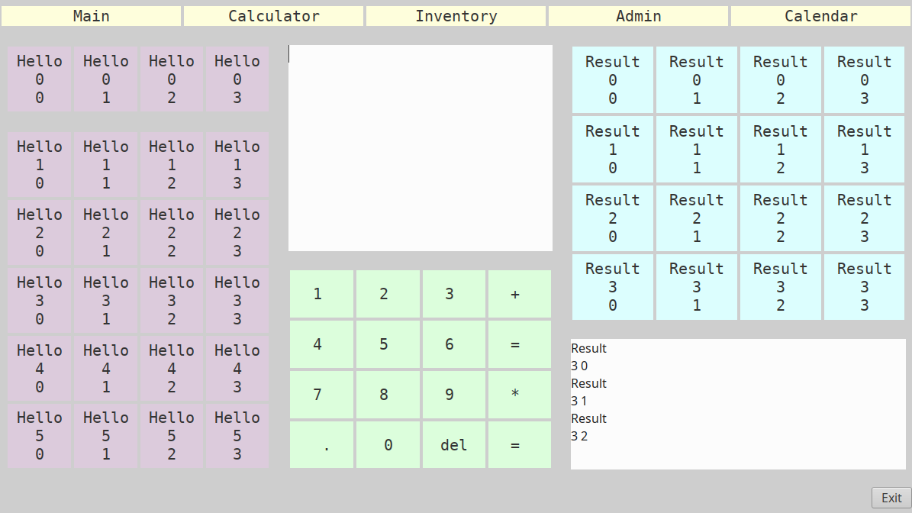

# pypos

## python gobject point-of-sale skeleton

 A tablet app skeleton for a point of sale application. Driven by touch or mouse
  click it delivers an event to the callback.

App to be written; but the skeleton contains useful code to any py based touch screen
app. Yes, it will run on the Pi.

